  

  

<!--   

   -->

## 👨‍💻 About Me

Hello world! I'm **Seyed Mohammad Hossein Taheri**, a 20-year-old **Backend & Infrastructure Engineer** from Iran. I design and build resilient, secure, and production-ready server-side architectures, API ecosystems, and automated infrastructure.

- 🔭 **Primary Focus:** Enterprise backend systems with **Spring Boot** and **Python**.
- 🛡️ **Security & Auth:** Production-level **Spring Security**, stateless **JWT**, and **Role-Based Access Control (RBAC)**.
- 🧪 **Engineering Quality:** Test-Driven Development mindset utilizing **JUnit 5** and **Mockito**.
- ☁️ **Infrastructure & Ops:** Hands-on Linux administration, VPS deployment, Reverse Proxies (Nginx), and Cloudflare networks.
- 🤖 **Automation:** Building intelligent workflow bots (Telegram/Bale), RAG architectures, and webhooks with **n8n** and **Python**.

---

## 🛠️ Technical Arsenal

### ⚙️ Backend Engineering `[ Core Focus ]`

> **Key Concepts:** `Spring MVC` • `Dependency Injection / IoC` • `Stateless RBAC` • `Clean Architecture` • `Unit & Integration Testing`

---

### 🗄️ Database & Storage

> **Concepts:** `Database Design` • `Data Normalization` • `Indexing & Optimization` • `JPQL` • `CRUD Operations`

---

### 💻 Infrastructure, Networking & Cloud

> **Concepts:** `Domain / DNS` • `Cloudflare Tunnel` • `Reverse Proxy` • `Network+ Fundamentals`

---

### 🤖 AI, Bots & Automation

> **Concepts:** `Workflow Automation` • `API Integration` • `Webhooks` • `AI API Integration`

---

### 🧩 Tools & Developer Workflow

---

### 🌐 Web & CMS

---

## 📬 Connect with Me

 

Designed with ❤️ by **MH TAHERI**

